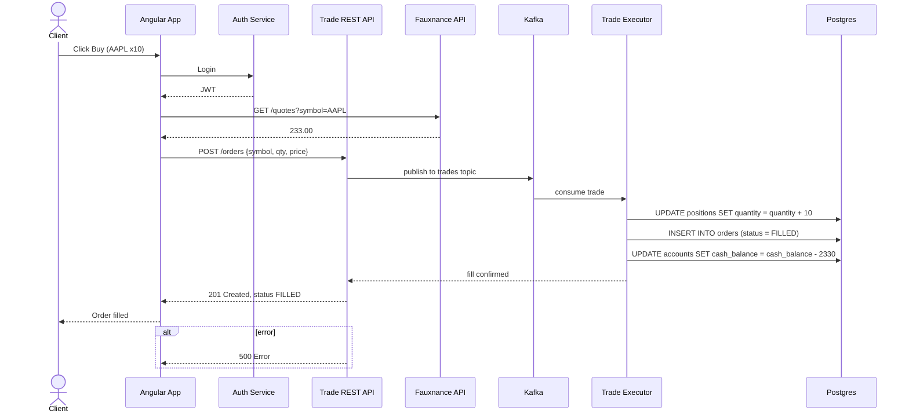

# Copilot draft (unvalidated)

Produced by GitHub Copilot Chat from `prompt.md`. Treat it as a draft: it has not been
checked against the platform contracts.

```mermaid
sequenceDiagram
    actor Client
    participant UI as Angular App
    participant Auth as Auth Service
    participant API as Trade REST API
    participant Fx as Fauxnance API
    participant Kafka
    participant Exec as Trade Executor
    participant DB as Postgres

    Client->>UI: Click Buy (AAPL x10)
    UI->>Auth: Login
    Auth-->>UI: JWT
    UI->>Fx: GET /quotes?symbol=AAPL
    Fx-->>UI: 233.00
    UI->>API: POST /orders {symbol, qty, price}
    API->>Kafka: publish to trades topic
    Kafka->>Exec: consume trade
    Exec->>DB: UPDATE positions SET quantity = quantity + 10
    Exec->>DB: INSERT INTO orders (status = FILLED)
    Exec->>DB: UPDATE accounts SET cash_balance = cash_balance - 2330
    Exec-->>API: fill confirmed
    API-->>UI: 201 Created, status FILLED
    UI-->>Client: Order filled
    alt error
        API-->>UI: 500 Error
    end
```
